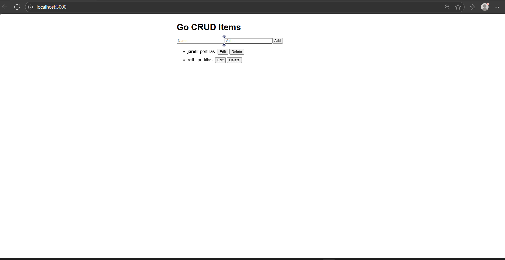

# Char2



## Overview
Char2 is a full-stack CRUD application with a Go backend and a React frontend.

## Backend (Go)
- REST API for managing items (Create, Read, Update, Delete)
- Runs on port 8080

## Frontend (React)
- Located in the `frontend` folder
- Connects to the Go backend for CRUD operations

## Getting Started

### Backend
1. Run the Go server:
   ```sh
   go run main.go
   ```

### Frontend
1. Open a terminal in the `frontend` directory.
2. Install dependencies:
   ```sh
   npm install --legacy-peer-deps
   ```
3. Start the development server:
   ```sh
   npm run dev
   ```
4. Visit [http://localhost:3000](http://localhost:3000) in your browser.

## Project Structure

- `main.go` - Go backend API
- `frontend/` - React frontend app
- `image.png` - Project screenshot

---
Made with Go and React.